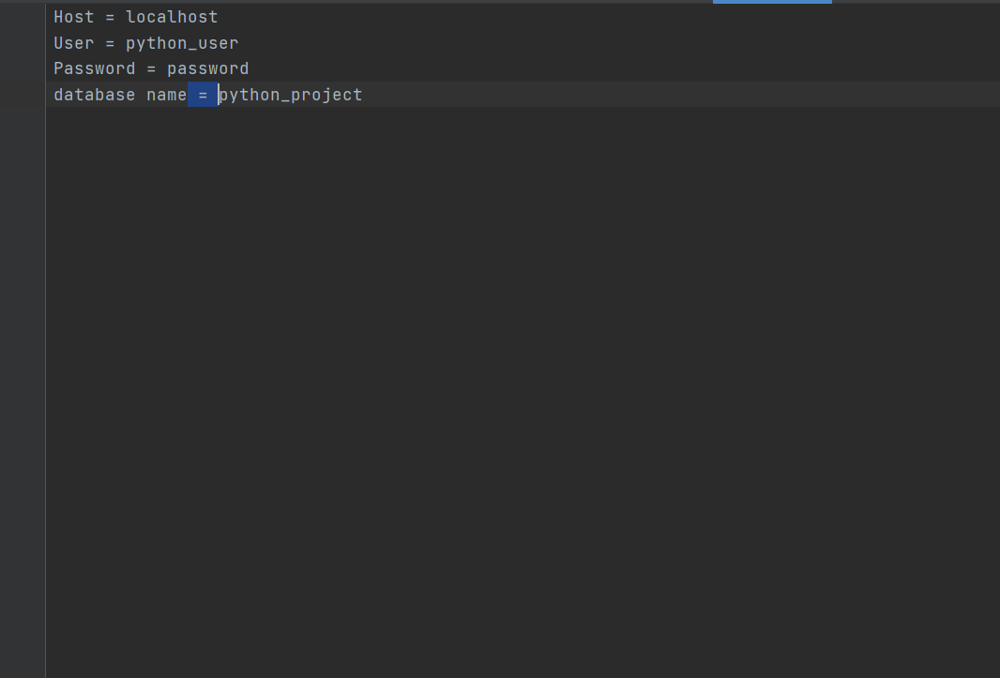
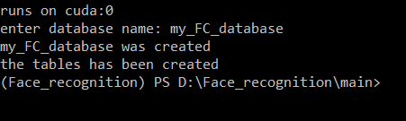
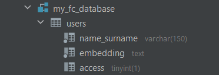

# How to use create_new_database.py

#### The file is used to create the database needed to run the application

The "config.txt" file is used to set the database parameters.

Format : parameter name, space, equality sign, space, your name.

After configuring "config.txt", run the script and enter the name of your future database

---
You will be rewarded with a message of completion and a database, with the name you chose.

