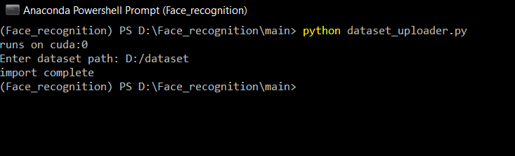

# How to use dataset_uploader.py

#### The file is used to upload the image dataset to the database

**Minimum dataset size 5 images.**

The program handles duplicates.

The dataset must be in the format: dataset folder, folders with a username, images

Run and enter the path of your dataset

