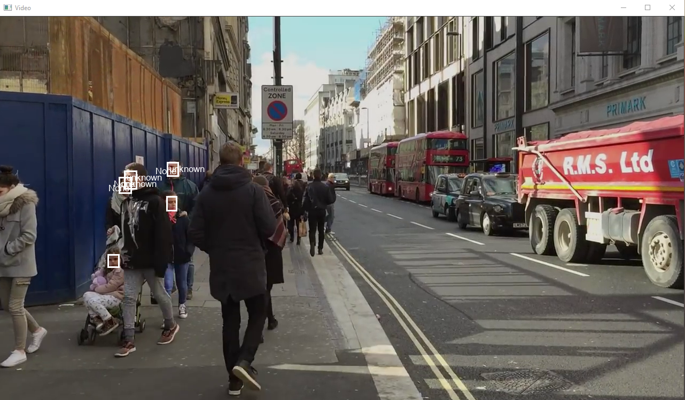
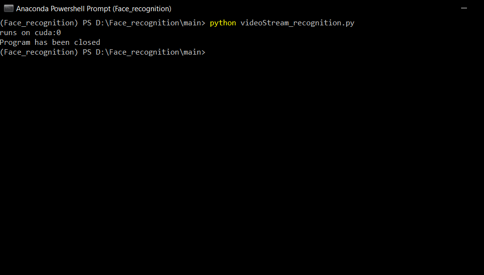

# How to use videoStream_recognition.py

The file is used to recognize people from the video stream.
By default, the setting is for the video from the camera, to change, 
enter the path to the video instead of 0.

In a file 'videoStream_recognition.py'
```python
v_cap = cv2.VideoCapture(0)
v_cap = cv2.VideoCapture('folder/my_video.mp4')
```



press ' f ' to close




