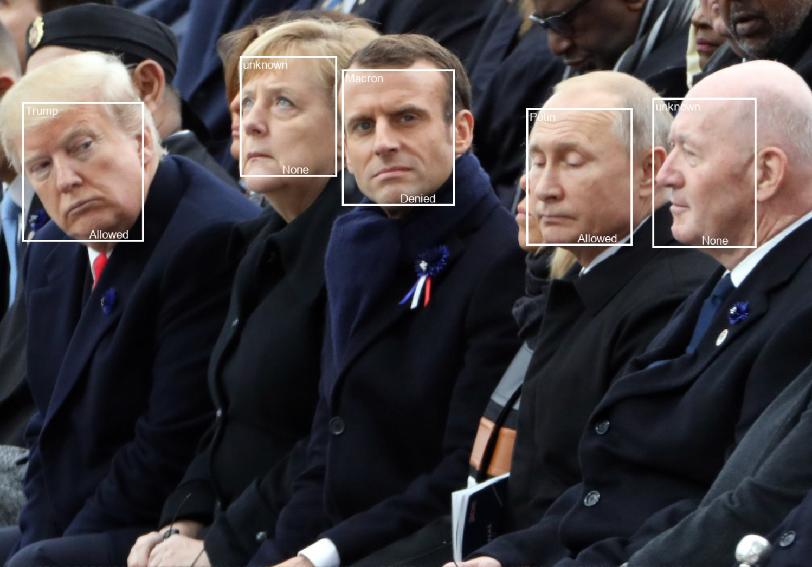

# Face recognition

Program for keeping records of people by using a camera. 
Based on face recognition, it verifies a person's identity and access level.

## Preparation
User must have permission to create and modify the database.

1. Create a new database and table \
`python Main.py create`
2. Upload dataset to database \
`python Main.py upload --dataset_path=images`

The dataset is composed of one folder of images per user. The name of each folder sets the user name.

## How to run
You have two choices, either
- run face recognition on a single frame \
`python Main.py recognize_image images/Putin/1.jpg`
- or from webcam stream \
`python Main.py recognize_stream` \
optionally, one can run detection in video by change a path  in Settings.py 
```python
 # path to video sample (default camera=0)
    path_to_video = 0
```

Unrecognized faces are labeled as "unknown". The bottom right corner corresponds to the access level (True=Allowed or False=Denied).

- Change access privilege for a subject: \
`python Main.py update_access user_name False`
  




Tested on the system
---
- processor - Intel i7 7700hq
- video card - NVIDIA GTX 1050 ti
- RAM - 16 GB
- operating system - Windows 10
